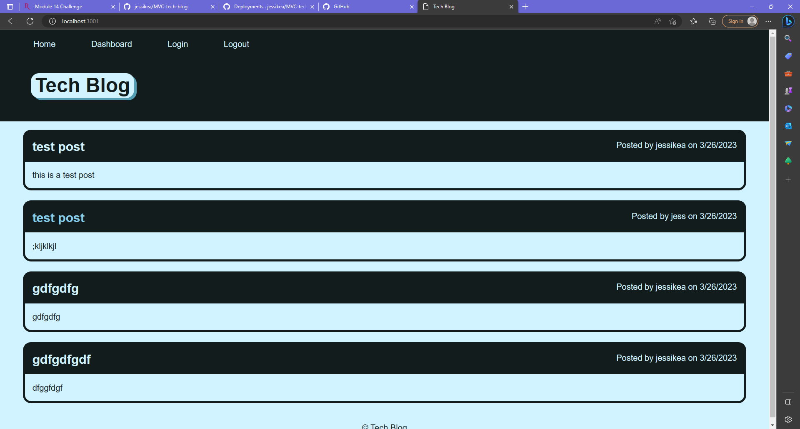

# MVC-tech-blog
This is a tech blog in which the user is able to create an account and login to post comments and see their own posts. Users can also edit and delete posts that they have previously made.

## Table of Contents

- [Installation](#installation)
- [Usage](#usage)
- [License](#license)
- [Contributions](#contributions)
- [Tests](#tests)
- [Questions](#questions)

## Installation

- Clone repo into local environment
- Have Node.js and run 'npm i' to install packages

## Usage

Instructions for use

- first, follow installation instructions then follow instructions bellow
- run 'npm start' to start application

Github repo: 
Screenshots: 

## License

MIT

## Contributions

## Features

N/A

## Tests

N/A

## Questions

